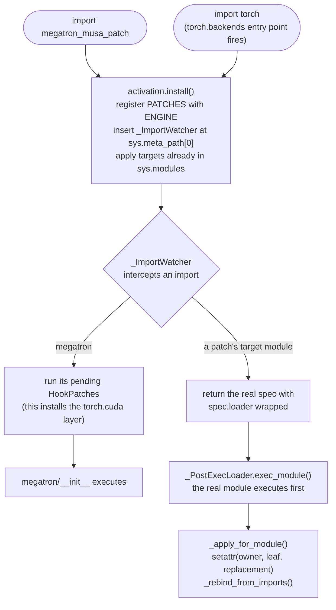

# Contributing to megatron-musa-patch

How this repository is put together, and how to add to it. Read this before
opening a change: section [1](#1-ground-rules) lists the constraints a patch has
to satisfy, [6](#6-adding-a-patch) walks through adding one, and
[11](#11-contributor-checklist) is the checklist to run before you push.

For *using* the package, see [`README.md`](README.md) instead.
Coding agents must also read [`AGENTS.md`](AGENTS.md) for the operational workflow,
test commands and completion criteria. The goal is unchanged upstream unit tests
and training scripts on MUSA, plus unchanged Megatron-Core calls from frameworks
such as ms-swift. A successful adapted example is only one part of that goal.

<https://github.com/kiscad/megatron-musa-patch> — branch `v0.16.1-dev` targets
Megatron-LM `core_v0.16.1`.

---

## 1. Ground rules

Six constraints shape every design decision here. A change that violates one of
them will be rejected even if it "works":

1. **Never copy upstream source.** Patches wrap or replace individual symbols.
   The moment a Megatron file is vendored, the two copies start drifting.
2. **Do not require callers to arrange patch imports.** Default autoload must
   activate before Megatron uses CUDA APIs. Support early and late explicit
   activation for diagnostics within the engine's limits: existing instances,
   closures and class bases cannot be repaired after the fact. A process that
   never imports Megatron should retain pending, inactive patches.
3. **Keep activation lazy and scoped.** In a process that has not imported
   Megatron, importing this package only registers patches and a watcher; it
   must not import torch/Megatron or activate the device shim. Already-loaded
   targets may be patched; explicit `apply()` intentionally imports targets.
4. **Every patch is deletable and reviewable.** Each one records `rationale`
   (the observed root cause), `strategy` (what the replacement does), `upstream`
   and `remove_when` (the condition, tied to tests, under which it goes). A
   patch whose `remove_when` condition has been met gets deleted, not kept
   "just in case".
5. **Keep upstream and callers unchanged.** Do not fix compatibility by editing
   Megatron source, tests, fixtures, assertions or training scripts, or by
   adding MUSA/CUDA branches or required patch imports to ms-swift. Implement
   adaptation in this package and exercise original entry points with autoload.
6. **Preserve the public contract and report gaps honestly.** Preserve signatures,
   configuration semantics, output structure, gradients, distributed behaviour
   and checkpoint compatibility. A fallback must preserve numerical correctness
   within justified tolerances and disclose performance/feature limits. Core
   fixes must work without `megatron.training`; skips, forced flags and smoke
   runs are not evidence of full compatibility.

---

## 2. Repository layout

```
src/megatron_musa_patch/
├── __init__.py            Public API; installs the watcher on import
├── activation.py          The three activation channels; owns PATCHES registration
├── _engine.py             The patch engine: registry, import hook, apply/unapply/report
├── _compat.py             Upstream version detection, target resolution, guards
├── _env.py                Every environment switch, in one place
├── _errors.py             Exception types
├── backends/
│   └── torch_cuda.py      torchada + the 4 Megatron-specific torch overrides
└── patches/
    ├── __init__.py        The ledger: aggregates PATCHES from the modules below
    ├── _torch_backend.py  Hook that installs the torch.cuda layer
    ├── _device_arch.py    NVIDIA-scale device capability / arch version
    ├── _distributed.py    Clean MCCL process-group teardown
    ├── _transformer_engine.py  Ignore upstream TE version thresholds on MUSA; TE calls dispatched by real signature
    ├── _layer_norm.py     Pure-PyTorch FusedLayerNorm, block LayerNormImpl
    ├── _rope.py           apex fused RoPE where Transformer Engine provides none
    ├── _training.py       fused_kernels.load / set_jit_fusion_options no-ops, DP-overlap policy, profiler selection
    ├── _checkpointing.py  No-fork distributed-checkpoint writer
    └── _control_collectives.py  Module-local torch proxies: startup timestamps, checkpoint host barrier, signal safe-globals

tests/
├── conftest.py                  Fresh-Engine and fake-module fixtures (unit runs stay CPU-safe)
├── test_engine.py               Engine core (no GPU, no Megatron)
├── test_engine_lifecycle.py     Chained patches, ownership, failure atomicity
├── test_activation.py           Activation channels and entry-point deferral (subprocess)
├── test_ledger.py               Ledger contract + scope guard rails
├── test_device_arch.py          Synthetic capability hook
├── test_layer_norm.py           Norm fallback class contract
├── test_te_layer_norm.py        TE norm-linear fallback contract (CPU + opt-in MUSA)
├── test_transformer_engine.py    MUSA Transformer Engine version-check policy
├── test_rope.py                 Fused-RoPE kernel selection and unfused demotion (CPU + opt-in MUSA)
├── rope_smoke.py                Hardware worker: apex kernels vs Megatron's unfused reference
├── test_training_profile.py     validate_args wrappers (overlap / profile)
├── test_checkpointing.py        Serial writer vs upstream protocol (stubbed upstream)
├── test_control_collectives.py  Control-collective proxies vs stubbed and real upstream (opt-in)
├── test_torch_cuda.py           Backend layer: CPU-safe stubs + real MUSA contracts
└── test_megatron_integration.py End-to-end against a real Megatron (subprocess, opt-in)

examples/                       run_pretrain_smoke.sh (2-GPU self-check), train_llama3_8b_musa.sh (MUSA llama3-8b), train_llama3_8b_h100_fp8.sh (upstream launcher)
```

Roughly: `_engine.py` is the machinery, `patches/` is the content, and the two
never need to know much about each other.

---

## 3. The patch engine

### 3.1 A patch is data

```python
AttrPatch(
    id="megatron.transformer-block.layer-norm.impl-local",
    target="megatron.core.transformer.transformer_block:LayerNormImpl",
    replace=_block_layer_norm_impl,        # Callable[[current_value], replacement]
    rationale="The affected TE MUSA norm op aborted in allocateSpace; ...",
    strategy="Bind the block's default norm to the patched local class; ...",
    upstream="NVIDIA/Megatron-LM megatron/core/transformer/transformer_block.py",
    remove_when="BLOCK_LAYERNORM=upstream passes LayerNorm/RMSNorm parity tests",
)
```

Two dataclasses, both in `_engine.py`:

| type | meaning |
|---|---|
| `AttrPatch` | Replace `<module>:<attribute>` with `replace(current)`. `target` may address a nested attribute (`module:Class.method`). Same-target patches chain: factories compose in registration order over one binding, repeat application never stacks wrappers, and `unapply()` restores the original in one step. |
| `HookPatch` | Run a callable before `trigger` (a module name) is imported; return `False` to decline. Hooks that own runtime state must pass `undo`, which `unapply()` calls in reverse order. |

Because `replace` receives the *current* object, a patch can wrap the original
with `functools.wraps` rather than replacing it outright. Returning `None` means
"leave it alone" and is recorded as `skipped` — that is how a patch opts out
conditionally (see `MEGATRON_MUSA_PATCH_BLOCK_LAYERNORM`).

### 3.2 Lifecycle

Use `AttrPatch.requires=("companion.id",)` only for unavoidable cooperation on
different attributes of the same module. The engine orders those targets,
rejects dependency cycles/cross-module requirements and reports a consumer as
`skipped` when its companion is absent, disabled or declined. It never expands
`ONLY` or overrides `DISABLE`. Keep independent factories independent; test
single selections, reversed order and uninstall, as in
`tests/test_patch_independence.py` and `tests/test_engine_dependencies.py`.



On the watched import path, a patch lands after its target module executes and
before the import returns to consumers. Default autoload should make a special
caller import unnecessary. Late activation still has the instance, closure and
class-base limitations described above; test the real caller's import path.

### 3.3 Details that are easy to get wrong

* **`find_spec` re-entrancy.** `importlib.util.find_spec("a.b")` imports the
  parent package and walks `sys.meta_path` from the top — which would call our
  own finder again and recurse. `Engine._find_real_spec` iterates the *other*
  finders directly.
* **`LazyLoader`.** A lazy loader defers `exec_module` past our hook and
  rewrites `spec.loader` to the inner loader, bypassing us on reload. The
  watcher unwraps it and forces eager loading for patched modules.
* **`from x import y`.** `import` binds by value, so a module that already did
  `from x import y` keeps the old object. The engine rebinds same-name aliases
  of *functions, classes and builtins* in modules under `megatron.` only —
  flags and primitives are never swept globally, and modules that declare the
  same symbol as their own patch target are left to their own lifecycle.
* **Reload.** `importlib.reload` re-executes the module body, restoring the
  original. `_apply_target` therefore re-checks identity on every call and
  rebuilds the chain from the recorded baseline instead of stacking wrappers.
* **Ownership.** A binding remembers whether the module originally owned the
  attribute: on `unapply()` owned attributes are restored and inherited ones
  are deleted, attributes someone else wrote after the patch are left alone,
  and a target changed outside the engine raises `PatchConflict`.
* **Atomic chains.** A target's chain (attribute + aliases) commits only when
  every factory succeeds; a failure rolls back to the baseline and is recorded
  as `failed`. A failing hook must clean up its own partial mutations, and a
  hook whose `undo` failed blocks reinstall until `unapply()` succeeds.
* **Absent modules.** When a target module is simply not installed (for example
  `megatron.training` with only the `megatron-core` wheel), the watcher records
  `skipped` once and stops watching, so the lookup is not repeated on every
  import.

### 3.4 Failure behaviour

`require_attr` raises `PatchTargetMissing` naming the patch id, the dotted
symbol and the detected Megatron version. A `replace` callable that raises gets
wrapped in `MegatronMusaPatchError` with the same context. Both are deliberate:
a silent no-op patch is far more expensive to debug than a loud failure at
import time.

---

## 4. Activation

`activation.py` owns the only three ways in, and all of them end in the same
idempotent `ENGINE.install()`:

| channel | entry point | notes |
|---|---|---|
| automatic | `[project.entry-points."torch.backends"]` → `megatron_musa_patch:_torch_backend_autoload` | PyTorch calls it at the very end of `import torch`. This is the official out-of-tree device-backend hook (torch_musa and torch_npu register there too). |
| explicit | `import megatron_musa_patch` | Registers and watches; applies nothing until Megatron appears. |
| imperative | `megatron_musa_patch.apply()` | Registers, watches, *and* imports target modules to apply everything now. Used by tests. |

`_torch_backend_autoload` must never raise: it runs inside `import torch`, and
an exception there breaks every process in the environment. It catches
everything and logs.

For a fresh process, installing the watcher does not activate the torch layer:
its `HookPatch` waits for `megatron`. Installing after targets are already loaded
can apply patches immediately, and explicit `apply()` imports targets itself.
Do not use an explicit-import-only test as proof that autoload works.

---

## 5. The `torch.cuda` compatibility layer

`backends/torch_cuda.py` is deliberately thin. It splits the work:

* **torchada** — a hard dependency — owns the mechanical translation:
  `torch.cuda.*` → `torch.musa.*`, `torch.device` patching, tensor-factory
  rewriting, `nccl` → `mccl`. That is the half that breaks when *torch_musa*
  moves, and it is Moore Threads' package to maintain. Note that importing
  torchada replaces `sys.modules["torch.cuda"]` with a caching proxy module
  and mutates factories/distributed state with no undo API — those effects
  are external and not reversible from here.
* **This module** owns the four things Megatron needs that torchada leaves
  out. That is the half that breaks when *Megatron* moves.

| override | why it exists |
|---|---|
| live `is_available()` | torchada deliberately leaves it `False`; Megatron asserts on it. Bound to `torch.musa.is_available`, not a constant. |
| `Tensor.type()` names | reports `torch.musa.*`; Megatron's optimizer compares against `torch.cuda.*`. Conversions and CPU names pass through. |
| `CUDAGraph` alias | torchada's `torch.cuda.graphs` has no `CUDAGraph`; expose `MUSAGraph` under the CUDA spelling. |
| `Tensor.musa()` for subclasses | torch_musa's C dispatch shim drops `non_blocking`/`memory_format` and mishandles CPU targets for tensor subclasses (TE `Float8Tensor`); route subclasses through `.to()`. |

Our overrides are journaled and restored to the *post-torchada* baseline by
`unapply()`; a third-party replacement made afterwards is left untouched, and
a failed activation rolls the overrides back. Removing torchada's own effects
requires a fresh process. We still never alias
`sys.modules["torch.cuda"] = torch.musa` ourselves: the namespaces genuinely
differ (`torch.cuda.memory` vs `torch.musa.core.memory`, and so on).

Behaviour torchada already provides is **not** re-implemented. It is asserted in
`tests/test_torch_cuda.py` instead, so a torchada regression fails loudly rather
than quietly depending on an override we wrote ourselves. That file is
organised into "overrides we own" and "contract with torchada" for exactly this
reason.

One trap worth remembering: `import torchada` *applies its patches* as an import
side effect. Never probe for it with `import torchada` — use
`importlib.util.find_spec`. An earlier revision of this package imported it just
to build a list of available modes, and thereby installed a global shim the
caller had not asked for.

---

## 6. Adding a patch

1. **Find the smallest seam.** Prefer, in order:
   * an existing Megatron implementation or supported extension point that can
     preserve the caller's original configuration (a flag that callers must
     change is a diagnostic workaround, not a completed compatibility fix),
   * a wrapper around one function,
   * a replacement class,
   * a minimal adaptation of one function — last resort; document the source,
     semantic differences and upgrade checks in `rationale`/`strategy`.
2. **Write the record** in the relevant `patches/_*.py` module (or a new one,
   registered in `patches/__init__.py`'s `MODULES`).
3. **Fill in `rationale`, `strategy`, `upstream` and `remove_when`.**
   `tests/test_ledger.py` enforces all four — this is not optional
   documentation. A hook that owns runtime state also needs `undo`.
4. **Keep `patches/` importable without torch.** Import `torch` inside the
   `replace` callable, never at module scope. `patches/_checkpointing.py` is the
   reference for this.
5. **Prefer `_env` switches over hardcoding.** Read them at call time (the
   helpers are lazy), so tests and wrappers can set them just before importing
   Megatron.
6. **Add a meaningful regression test.** Engine behaviour uses fake modules;
   patch contracts belong in the relevant `test_*.py`. Run integration tests
   that activate the real patch set in fresh subprocesses, then rerun the
   original failing upstream test or caller without changing it. A stub alone
   cannot establish API or numerical compatibility.

### Worked example

Say `megatron.core.transformer.moe.router` grows a `TopKRouter` that assumes
NVIDIA-specific behaviour:

```python
# src/megatron_musa_patch/patches/_router.py
from __future__ import annotations

from typing import Any

from .._engine import AttrPatch

__all__ = ["PATCHES"]


def _router_impl(original: Any) -> Any:
    """Wrap rather than replace: keep upstream's behaviour, change one branch."""
    import functools

    @functools.wraps(original)
    def forward(self, *args, **kwargs):
        # ... MUSA-specific adjustment ...
        return original(self, *args, **kwargs)

    return forward


PATCHES = (
    AttrPatch(
        id="megatron.moe.router.topk-forward",
        target="megatron.core.transformer.moe.router:TopKRouter.forward",
        replace=_router_impl,
        rationale="...the observed failure and why...",
        strategy="...what the wrapper changes and preserves...",
        upstream="NVIDIA/Megatron-LM megatron/core/transformer/moe/router.py",
        remove_when="...condition, tied to tests, under which this goes...",
    ),
)
```

Then add it to `MODULES` in `patches/__init__.py`, run
`MEGATRON_MUSA_PATCH_DEBUG=1 python -c "import megatron_musa_patch as m; m.apply()"`
and confirm the new id reports `applied`.

### Extending from outside the package

Downstream projects can register their own patches without forking:

```python
from megatron_musa_patch import AttrPatch, ENGINE

ENGINE.register([AttrPatch(id="my-project.x", target="...", replace=lambda old: ...)])
ENGINE.apply_now()
```

They get the same ordering guarantees, drift detection and `report()` entries.
This is an optional extension API; general MUSA compatibility belongs in this
package and must not depend on downstream registration.

---

## 7. Testing

```bash
python -m pip install -e ".[dev]"
python -m pytest -q    # works on CPU; hardware-dependent cases may skip
MEGATRON_MUSA_RUN_INTEGRATION=1 MEGATRON_LM_PATH=/path/to/Megatron-LM \
    python -m pytest tests/test_megatron_integration.py -q    # real-stack checks (subprocess)
```

| file | covers | needs |
|---|---|---|
| `test_engine.py` | import hook, alias repair, reload, unapply, filters, error paths | nothing (synthetic modules) |
| `test_engine_lifecycle.py` | chained same-target patches, ownership, failure atomicity, hook undo | nothing |
| `test_activation.py` | activation channels, entry-point deferral, disabled apply | nothing (subprocess) |
| `test_ledger.py` | ledger contract: unique ids, non-empty `rationale`/`strategy`/`upstream`/`remove_when`, hook undo, probes do not wake the watcher | nothing |
| `test_device_arch.py` / `test_layer_norm.py` / `test_training_profile.py` / `test_checkpointing.py` | per-patch contracts against stubbed upstream APIs | megatron-core (some) |
| `test_te_layer_norm.py` | the TE norm-linear fallback: class dispatch, RMSNorm passthrough, sharded state dict | CPU contract + megatron-core; MUSA rounds opt-in |
| `test_rope.py` | fused-RoPE selection: apex kernels only where upstream has none, TE kernels untouched, `ROPE_FUSION=0`, interleaved/context-parallel demotion without mutating shared config | nothing; the parity round runs `rope_smoke.py` on MUSA, opt-in |
| `test_control_collectives.py` | module-local torch proxies: startup timestamps, checkpoint host barrier, signal safe-globals, upstream exit policy | torch; real-upstream rounds need `MEGATRON_LM_PATH`, two-rank MUSA round is opt-in |
| `test_torch_cuda.py` | the compatibility layer and the torchada contract | stubs run anywhere; real contracts need MUSA |
| `test_megatron_integration.py` | a real Megatron: every patch resolves to applied/skipped, patched `FusedLayerNorm` matches `torch.nn.functional.layer_norm`, `get_device_arch_version() == 8`, `fused_kernels.load` is a no-op | Megatron + MUSA, opt-in |

Notes for writing tests:

* `conftest.py` exposes a fresh `Engine()` fixture, so engine tests never touch
  the process-wide registry, plus `fake_package` (writes a throw-away importable
  module) and `stub_module` (injects a synthetic module into `sys.modules`).
* `test_megatron_integration.py` **must** run in a subprocess. The patch set is
  process-global; running it in-process would make results order-dependent.
* When you find a gap in a delegate, add a test rather than an override. The
  `test_torchada_*` functions are the contract we rely on but do not implement.

End-to-end check on hardware:

```bash
MEGATRON_LM_PATH=/path/to/Megatron-LM NPUS=2 \
    PYTHON=/path/to/venv/bin/python bash examples/run_pretrain_smoke.sh
```

A healthy run finishes 5 iterations with finite loss, saves a `torch_dist`
checkpoint, and exits without MCCL errors or hangs. A tiny mock run need not have
monotonically decreasing loss. The script recreates `OUTPUT_DIR` and disables
optimizer/RNG saving; use a scratch directory, and validate full save/resume
separately when a change affects checkpoint semantics.

### Acceptance beyond this repository's tests

Run applicable checks in separate processes: package regressions; original
Megatron-LM unit tests via its distributed pytest entry; original training
scripts; and an actual ms-swift Megatron-Core workflow. Also verify a wheel-only
environment with the Megatron-LM checkout absent from `PYTHONPATH` and the working
directory. The [agent runbook](AGENTS.md) gives commands and reporting criteria.

Do not modify upstream `conftest.py`, add MUSA skips/xfails, relax assertions, or
replace original tests with local equivalents. Record collected/pass/fail/skip
counts and reasons: an exit code of zero with no tests executed is not success.
Use resource and dataset settings required by the original tests; inability to
run a case remains an explicit validation gap. Test autoload without importing
this package in the caller; `apply()`-based diagnostics test a different channel.

---

## 8. Design decisions and rejected alternatives

| Rejected | Why |
|---|---|
| Vendoring whole upstream files (the previous `musa_patch/` approach) | 67 files / 12.8k lines / 32 copied classes drift silently, need `for k in sys.modules: setattr(...)` sweeps, and leave no inventory of what changed. |
| `unittest.mock` / `pytest.monkeypatch` | They destroy `__name__`, `__signature__` and `__wrapped__`, objects leak into `isinstance` checks, and they are not reversible in production. |
| AST / `SourceLoader` rewriting | Powerful, and the only way to change a base class at definition site — but the transformed code is cached into the normal `__pycache__`, poisoning every later process on the machine unless you implement pytest-style tagged pyc paths. Not worth it for patches that are all attribute assignments. |
| A `.pth` file for auto-activation | Costs every interpreter in the environment; failure modes are a traceback per process (or silently ignored lines); `python -S` bypasses it. The `torch.backends` entry point fires early enough and is opt-out-able. |
| `sitecustomize.py` | Hijacks an admin-owned namespace, collides with other packages, swallows its own errors. |
| `wrapt` | Excellent library, but this patch set needs ~10 wrappers and its bookkeeping (handles for `unapply`, identity for idempotency) is a dozen lines we already have. One fewer dependency on the activation path. Revisit if wrapper chains ever get deep. |
| Declaring Megatron as an install dependency | `megatron-core` on PyPI ships only `megatron/core/`, but four patches target `megatron.training` / `megatron.legacy`, which the wheel does not contain. There is no `megatron-lm` on PyPI. The real workflow wants a source checkout pinned to a tag, which pip cannot express — and since `megatron` is a namespace package a pip-installed copy is *merged* with the checkout rather than replacing it, decided by `sys.path` order. The version contract is enforced at runtime against what is actually importable instead (`_compat.check_version`, `check_megatron_present`). |
| Writing our own `torch.cuda` alias layer | It existed, it was 432 lines, and it scored *worse* than torchada on coverage. Maintaining a second-rate copy of a vendor package is not a good use of anyone's time. |
| Swapping `sys.modules["torch.cuda"] = torch.musa` | The namespaces differ (`torch.cuda.memory` vs `torch.musa.core.memory`, `nccl` vs `mccl`, ...). Submodule imports and anything holding a reference to the original module break. |
| Re-implementing what torchada already does | Duplicated code that will rot at a different rate than the thing it duplicates. Assert it in tests instead. |

---

## 9. Debugging

```bash
# What landed, what was skipped, and why
python -c "import megatron_musa_patch as m, json; print(json.dumps(m.report(), indent=2))"

# Watch patches land, with the trigger that fired them
MEGATRON_MUSA_PATCH_DEBUG=1 python -c "import megatron_musa_patch as m; m.apply()"

# Isolate one patch
MEGATRON_MUSA_PATCH_DISABLE=megatron.dist-ckpt.no-fork-writer python train.py

# Or the whole package
MEGATRON_MUSA_PATCH=0 python train.py
```

Useful invariants when investigating a report:

* `pending` before target imports is normal for lazy activation. After a
  successful `apply()` it requires investigation: inspect import errors,
  unresolved modules and the affected record's `detail`.
* `skipped` means either the environment disabled it (`detail` says so), the
  module is not installed, or the `replace` callable declined.
* Empty `report()` means the package never installed — check
  `MEGATRON_MUSA_PATCH=0` and the entry point registration.

---

## 10. Branching and releases

`v0.16.1-dev` is the development branch for Megatron-LM `core_v0.16.1`. A new
upstream release gets a **new branch** (`vX.Y.Z-dev`) rather than a breaking
change on this one.

The package version tracks the upstream release, so `pyproject.toml` is the only
place a version literal appears (`__version__` reads it back from the installed
metadata):

| version | when |
|---|---|
| `0.16.1.dev0` | on `v0.16.1-dev` |
| `0.16.1` | a release cut from it |
| `0.16.1.post1` | a fix on top of that release |
| `0.16.2.dev0` | new branch `v0.16.2-dev` |

When bumping the target upstream version, also update
`SUPPORTED_VERSION_SPEC` and `_in_supported_range()` in `_compat.py`, the reference
environment and actual validation results in both READMEs, and expect
`test_ledger.py` / the integration test to point at whatever
moved.

---

## 11. Contributor checklist

Before opening a change:

Apply code/runtime checks to the affected behaviour. Documentation-only changes
need link, command-syntax and source-consistency checks, not a training run.

- [ ] No upstream file was copied into this repository.
- [ ] Upstream tests, assertions, training scripts and framework callers remain
      unchanged; the original failing entry point was rerun with autoload.
- [ ] Core compatibility does not depend on `megatron.training` or framework-side
      MUSA branches; wheel-only coverage and any unavailable checks are recorded.
- [ ] The patch works regardless of import order, and is exercised before
      Megatron uses CUDA APIs (test with `import megatron` before and after
      `import megatron_musa_patch`).
- [ ] `rationale`, `strategy`, `upstream` and `remove_when` are filled in and
      specific.
- [ ] `patches/` still imports cleanly without `torch` on the path.
- [ ] New behaviour is behind an `_env` switch if a user might reasonably want
      the upstream behaviour back.
- [ ] For code changes, `python -m pytest -q` passes, including applicable
      `MEGATRON_LM_PATH=... python -m pytest tests -q` coverage.
- [ ] If hardware was available: `examples/run_pretrain_smoke.sh` exits 0 with
      zero MCCL errors.
- [ ] Both `README.md` and `README_zh.md` are updated if a user-visible
      behaviour, flag or switch changed.
- [ ] Applicable acceptance commands, revisions, pass/fail/skip counts, fallback
      trade-offs and unresolved gaps are recorded; workflow changes also update
      both contributor guides and `AGENTS.md`.

## License

Licensed under the upstream Megatron-LM `LICENSE` (NVIDIA BSD-style main terms; Apache-2.0 for incorporated third-party code).
