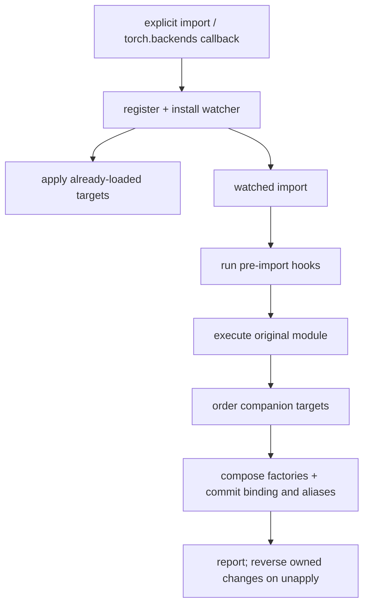

# Contributing to megatron-musa-patch

This guide describes the design and extension contracts. [README.md](README.md)
covers installation, switches and fallback costs; [AGENTS.md](AGENTS.md) owns the
operational workflow and full acceptance commands. [中文](CONTRIBUTING_zh.md).
The ledger in `patches/` and `report()` is the source of truth for patch metadata.

## 1. Ground rules

- Keep upstream source, tests and callers unchanged. Core compatibility must also
  work with a `megatron-core` wheel, without `megatron.training` or caller-side
  MUSA branches. New capabilities implemented only in a higher-level framework
  belong to that framework.
- Adapt individual symbols, reusing upstream implementations where possible.
  Preserve arguments, outputs, gradients, RNG, distributed synchronization and
  checkpoint keys/sharding. Document fallback costs and limitations.
- Keep registration standard-library-only. Import torch, Megatron, TE and
  torchada inside runtime callbacks. Importing torchada has global side effects;
  never import it merely to test availability.
- Declare patches through the existing engine. Every built-in record needs a
  root cause, strategy, upstream location and testable removal condition.
  Hooks owning state must provide `undo` and clean up partial failures.
- Retain ownership checks, idempotence and failure diagnostics. Unit tests and
  adapted smoke runs establish only their exercised paths, not full compatibility.

## 2. Repository layout

| Location | Responsibility |
|---|---|
| `__init__.py`, `activation.py` | Public API and activation channels |
| `_engine.py` | Registration, imports, target transactions, aliases and undo |
| `_compat.py`, `_errors.py` | Metadata, source probes, target resolution and errors |
| `_env.py` | Lazy environment switches and their defaults |
| `backends/` | Shared lazy runtime probe; torchada integration and four owned device overrides |
| `patches/_*.py` | Domain-specific factories/hooks with their ledger records |
| `patches/__init__.py` | Aggregation and intentional same-target ordering |
| `tests/test_*.py` | Engine, contract, numerical and opt-in integration regressions |
| `tests/*_smoke.py`, `examples/` | Hardware workers and diagnostic launchers |
| `scripts/ci/`, `pyproject.toml` | Shared checks and tool configuration |

Patch modules do not import sibling patches. Shared runtime checks belong in
`backends`, generic lifecycle rules in the engine, and operator choices in the
corresponding patch. See [PATCH_INDEPENDENCE.md](docs/PATCH_INDEPENDENCE.md) for
the current cooperation boundaries.

## 3. The patch engine

### Records and lifecycle

`AttrPatch(target="module:Class.method", replace=factory)` receives the current
value. Return a replacement, or `None` to decline. Factories for one target
compose in registration order and commit as one transaction. Static/class
method descriptors and inherited-attribute ownership are preserved.

`HookPatch(trigger="module", run=callback, undo=cleanup)` runs before import.
Return `False` to decline. Hooks without undo remain applied across uninstall,
because their effects cannot be claimed as restored. A failing hook must undo
its own partial mutations; the engine does not make imports a global transaction.



`requires=("companion.id",)` declares a dependency on another attribute in the
same module. Missing, disabled, version-excluded or declined companions leave
the consumer skipped; the engine never enables them implicitly. If no factory
can run and no binding exists, target lookup is skipped too. Cycles, cross-module
requirements and requirements on the same target are rejected. A later
registration can make a skipped consumer eligible.

Same-name function/class/builtin aliases are repaired only within the configured
`rebind_prefixes` (default `megatron`). Primitive flags and separately declared
targets are excluded. Reload and live registration rebuild from the baseline;
aliases imported after the first application follow the new generation as well.
Existing instances, closures and class bases cannot be repaired this way.

Internal availability probes use `_compat.find_spec_without_watchers`, without
importing parents or running hooks. External speculative `find_spec` calls can
still trigger hooks. Watched `LazyLoader` modules are executed eagerly so patches
apply before consumers use their attributes.

`unapply()` restores only bindings still owned by the engine and attempts all
cleanups. Failed cleanups remain journaled and block reinstall until a retry
succeeds. Third-party replacements are preserved. Configure before training;
do not mutate the registry concurrently with running model code.

### Version gates

Both record types accept `version_gates=("transformer_engine >=2.0,<2.1",)`.
The shared validator runs at construction. Runtime checks read distribution
metadata without importing the package; only parsed declarations are cached.

- Comparisons within and across gates are AND-ed. Supported operators are
  `>=`, `>`, `<=`, `<`, `==`, `!=`; bounds are dot-separated integers.
- Numeric releases are zero-padded (`2.0 == 2.0.0`). Installed `rc/dev/post/local`
  suffixes do not affect ordering. This is not full PEP 440; epochs, wildcards
  and `~=` are unsupported. Distribution names normalize case and `-`, `_`, `.`.
- Missing metadata permits normal target/capability handling; malformed installed
  versions skip the patch. Neither result proves compatibility.
- `MEGATRON_MUSA_PATCH_IGNORE_VERSION_GATES=1`/`true`/`*` bypasses all gates;
  a comma-separated package list bypasses only those packages. `0`/`false`/`off`
  bypasses none. Selection, dependencies and capability probes still apply.
- Set switches before activation. Use a fresh process after changing them, or
  uninstall/reinstall only the reversible part. Reports retain gates and reasons.

Source probes return `True` for matching markers, `False` for absent sources or
markers, and `None` for undecidable layouts. Current callers keep their fallback
on `None`. A missing marker or an excluded version is not removal evidence:
disable the patch and rerun the original failure. Capability probes must preserve
training RNG and check results to expose asynchronous failures.

## 4. Activation

| Channel | Entry | Behavior |
|---|---|---|
| Automatic | `torch.backends` → `megatron_musa_patch:torch_backend_autoload` | Install during the end of torch initialization, inside a logging/error boundary |
| Explicit | `import megatron_musa_patch` | Register and watch; patch already-loaded targets |
| Immediate | `megatron_musa_patch.apply()` | Also import targets and apply now; diagnostic use |

Device adaptation waits for Megatron. Only the MUSA-fork-specific
`megatron.te.factory-shim.torchscript-compat` and
`megatron.te.utils-module.safe-seed` hooks may run at the earlier TE import
boundary to support scripting before Core import. They do not authorize other
early hooks. Keep automatic activation failures from breaking `import torch`.
`AUTOLOAD=0` disables the automatic channel; `MEGATRON_MUSA_PATCH=0` disables all.

## 5. Backend ownership

torchada owns CUDA-to-MUSA API/device/backend translation. This package adds
live availability, CUDA tensor type names, the graph-class alias and tensor
subclass `.musa()` transfers. Its journal restores the post-torchada baseline,
including on activation failure, and preserves subsequent third-party writes.

Import-time changes by torchada/torch_musa are not reversible here. Use a new
process for complete isolation; never directly alias `sys.modules["torch.cuda"]`
to `torch.musa`. Test delegated torchada behavior instead of copying it.
`backends.musa_available()` reads the current runtime without importing torchada
or caching device availability.

## 6. Adding a patch

1. Reproduce the original failure and locate the smallest upstream seam. Keep
   core fixes independent of training-only entry points.
2. Add a factory/hook in the owning `patches/_*.py` module. Use `functools.wraps`
   on wrappers and preserve the unaffected path.
3. Fill `id`, `target`/`trigger`, `rationale`, `strategy`, `upstream`, `remove_when`.
   Add `undo` for owned hook state, `requires` for same-module cooperation, and
   version/source/capability guards supported by evidence.
4. For a new module, add its import and entry in `patches.MODULES`. Do not reorder
   unrelated same-target wrappers. Keep registration free of accelerator imports.
5. Add a regression that fails before the fix, then exercise the real caller.
   Document switches in `_env.py` and both READMEs; keep both guides consistent.

```python
from functools import wraps
from megatron_musa_patch import AttrPatch, ENGINE


def replace(original):
    @wraps(original)
    def wrapped(*args, **kwargs):
        return original(*args, **kwargs)  # implement the narrowly justified adaptation
    return wrapped


ENGINE.register([AttrPatch(
    id="my-project.example",
    target="my_project.module:function",
    replace=replace,
    rationale="Observed failure and affected environment",
    strategy="Exact adaptation and preserved contracts",
    upstream="Original file and symbol",
    remove_when="Unpatched regression passes on the upgraded stack",
)])
ENGINE.apply_now()
```

External registration is optional extensibility; callers must not need it for
this package's built-in compatibility contract.

## 7. Tests and local checks

Use the interpreter matching the vendor stack. Do not upgrade torch/TE merely
to run development tools. With the required test/tools already installed:

```bash
python -m pip install --no-deps -e '.[dev]'
python -m pytest tests -q
bash scripts/ci/pre-push.sh
# Optional local Git hooks; requires pre-commit and the tools used by scripts/ci.
bash scripts/setup-dev-hooks.sh
```

`--no-deps` does not install dev dependencies. CI uses the same scripts;
`quick-check.sh` runs ruff/black/isort, `lint.sh` also runs mypy, and
`unit-tests.sh` runs pytest. Hardware workers are not launched by default.

Engine changes require activation, lifecycle, dependency, version-gate and ledger
regressions. Operator changes need forward/backward references and relevant
checkpoint contracts. Unit fixtures isolate watchers and synthetic modules;
full patch activation belongs in subprocesses. Control distribution metadata in
tests rather than relying on whichever vendor libraries happen to be installed.

```bash
MEGATRON_MUSA_RUN_INTEGRATION=1 MEGATRON_LM_PATH=/path/to/Megatron-LM \
    python -m pytest tests -q
MEGATRON_LM_PATH=/path/to/Megatron-LM PYTHON=/path/to/venv/bin/python NPUS=2 \
    bash examples/run_pretrain_smoke.sh
```

The launcher defaults to a unique temporary output directory and prints it.
An explicit `OUTPUT_DIR` must be new or empty; relative paths resolve from the
calling directory. Existing outputs are never deleted. This smoke saves neither
optimizer nor RNG state and does not validate full state restoration.

For original upstream tests/training, wheel-only validation and actual ms-swift
workflows, follow [AGENTS.md](AGENTS.md#6-分层验证记录执行了什么而不是只记录退出码).
Record actual pass/fail/skip counts and missing resources; do not weaken upstream
assertions or add MUSA skips to conceal failures.

## 8. Design boundaries

Keep one patch engine and one ledger. Avoid upstream file copies, source
rewriting, `.pth`/`sitecustomize` activation and broad module scans. Scoped
attribute replacement fits the current requirements without adding another
wrapper framework. Add abstraction when concrete shared behavior justifies it.

Megatron is intentionally an environment dependency: callers may use a pinned
checkout or a Core wheel. Runtime metadata is advisory; record the actual import
path and revision because namespace packages can combine multiple installations.

## 9. Diagnostics

Inspect `report()` for `pending`, `applied`, `skipped`, `failed` and `detail`.
Pending before target import is normal. An empty report means no records are
registered in that process, for example because activation is disabled; it does
not by itself diagnose missing entry-point metadata.

Use `MEGATRON_MUSA_PATCH_DEBUG=1` for logging, `ONLY`/`DISABLE` to isolate records,
and a new process with `MEGATRON_MUSA_PATCH=0` for a disabled baseline. `ONLY`
takes precedence. `PatchTargetMissing` indicates symbol drift; `PatchConflict`
indicates an ownership/cleanup conflict. Explicit `apply()` is a diagnostic
channel and does not validate the caller's automatic activation path.

## 10. Branches and releases

The `v0.16.1-dev` branch targets `core_v0.16.1`; package version lives only in
`pyproject.toml` and is read from installed metadata. Use `0.16.1.dev0` for
development, `0.16.1` for the release, and `0.16.1.post1` for a follow-up fix.
Start a new branch for a new upstream release. Review `SUPPORTED_VERSION_SPEC`,
`_in_supported_range()`, capability probes and each ledger removal condition;
update the READMEs with actual validation evidence.

## 11. Contributor checklist

- Changes stay in this repository and preserve pre-existing work.
- Contracts, selection, ownership and failure paths have relevant regressions.
- Static checks and applicable tests pass; unexecuted acceptance paths are named.
- Source and bilingual documentation agree; ledger removal conditions are testable.
- `git diff --check` passes; artifacts, checkpoints and copied upstream files are
  excluded from the change. Report revisions, commands, results and limitations.
