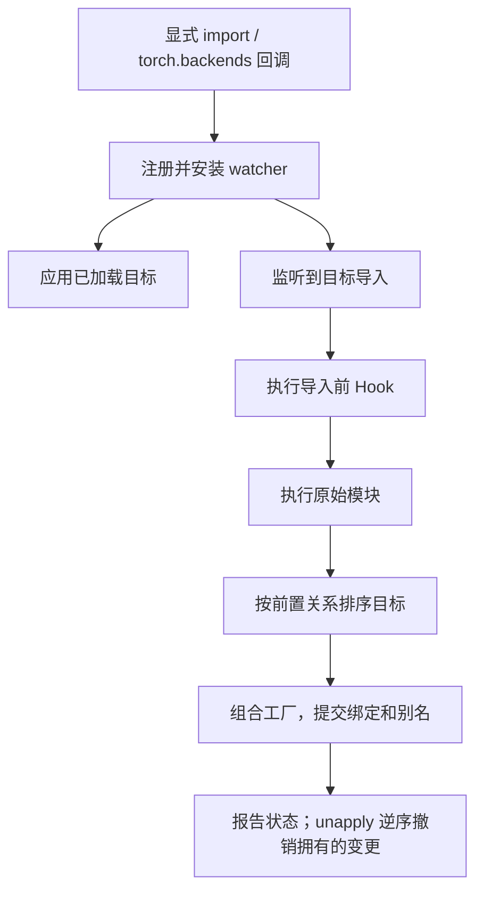

# megatron-musa-patch 贡献指南

本文维护设计与扩展契约。[README_zh.md](README_zh.md) 负责安装、开关与回退取舍；
[AGENTS.md](AGENTS.md) 负责开发流程及完整验收命令。[English](CONTRIBUTING.md)。
补丁元数据以 `patches/` 中的 ledger 和 `report()` 为准；人类可读的补丁目录见 [docs/PATCHES_zh.md](docs/PATCHES_zh.md)。

## 1. 基本原则

- 保持上游源码、测试和调用方不变。Core 兼容必须在只有 `megatron-core` wheel、没有
  `megatron.training` 的环境中生效，无需下游添加 MUSA 分支。上层框架先于 Core 实现的
  新能力，其适配由该框架负责。
- 以单个符号为适配边界，优先复用上游实现。保留参数、输出、梯度、RNG、分布式同步、
  checkpoint key/sharding，并说明回退成本与限制。
- 注册路径只使用标准库。torch、Megatron、TE、torchada 在运行时回调内导入；
  torchada 导入会产生全局副作用，不能用于安装探测。
- 使用已有引擎声明补丁。每条内置记录必须有根因、策略、上游位置及可测试的移除条件。
  拥有状态的 Hook 提供 `undo`，失败时自行清理部分变更。
- 保留所有权检查、幂等性与失败诊断。单元测试和改参数的 smoke 只证明实际执行的路径，
  不代表整个项目已经兼容。

## 2. 项目结构

| 位置 | 职责 |
|---|---|
| `__init__.py`、`activation.py` | 公开 API 与激活通道 |
| `_engine.py` | 注册、导入监听、目标事务、别名与撤销 |
| `_compat.py`、`_errors.py` | 元数据、源码探针、目标解析与异常 |
| `_env.py` | 惰性环境开关及默认值 |
| `backends/` | 共享惰性设备探测、torchada 接入及本包拥有的四项设备覆盖 |
| `patches/_*.py` | 按领域组织的工厂/Hook 及其 ledger |
| `patches/__init__.py` | 聚合补丁，维护有意设计的同目标顺序 |
| `tests/test_*.py` | 引擎、契约、数值与可选集成回归 |
| `tests/*_smoke.py`、`examples/` | 硬件 worker 与诊断启动器 |
| `scripts/ci/`、`pyproject.toml` | 共用检查入口与工具配置 |

补丁模块不导入兄弟补丁。共享运行时探测放在 `backends`，通用生命周期规则放在引擎，
算子选择留在对应补丁。当前协作边界见[补丁独立性记录](docs/PATCH_INDEPENDENCE.md)。

## 3. 补丁引擎

### 记录与生命周期

`AttrPatch(target="module:Class.method", replace=factory)` 接收目标当前值，返回替代值，
或以 `None` 表示退出。同目标工厂按注册顺序组合，作为一个事务提交。保持 staticmethod、
classmethod 描述符语义，并记录属性是否继承而来。

`HookPatch(trigger="module", run=callback, undo=cleanup)` 在导入前运行，返回 `False`
表示退出。没有 undo 的 Hook 在卸载后仍报告已应用，因为不能声称其效果已还原。
Hook 失败必须自行清理部分变更；引擎不会将所有导入包装成一个全局事务。



`requires=("companion.id",)` 声明同模块不同属性的前置补丁。前置缺失、禁用、被版本
门控排除或主动退出时，消费者跳过，引擎不会隐式开启前置。若没有工厂可执行且没有旧绑定，
也不解析目标符号。循环、跨模块和同目标依赖在注册时拒绝。晚注册前置可以使消费者重新评估。

同名函数、类、builtin 别名只在 `rebind_prefixes`（默认 `megatron`）范围内修复，
不处理基本类型标志位及独立声明的目标。reload 和运行后追加注册从基线重建，初次应用后
才导入的别名也跟随新一代绑定。已有实例、闭包和类基类无法通过该机制修复。

内部安装探测使用 `_compat.find_spec_without_watchers`，不导入父包、不触发 Hook。
外部试探性的 `find_spec` 仍可能触发 Hook。监听到 `LazyLoader` 时强制立即执行目标模块，
确保调用方使用属性之前补丁已应用。

`unapply()` 只还原仍由引擎拥有的绑定，尝试所有清理；失败项保留日志，重试成功前拒绝
重新安装。第三方后来写入的对象保留。应在训练前配置，不要在模型运行期间并发修改注册表。

### 版本门控

两种记录都支持 `version_gates=("transformer_engine >=2.0,<2.1",)`，构造时由共享校验器
检查。运行时读取发行包元数据，不导入目标包；仅缓存声明的解析结果。

- gate 内部及多个 gate 之间均为 AND。支持 `>=`、`>`、`<=`、`<`、`==`、`!=`，
  边界为点分整数。
- 数字 release 补零比较（`2.0 == 2.0.0`）；安装版本的 `rc/dev/post/local` 后缀不参与
  排序。这不是完整 PEP 440，不支持 epoch、通配符和 `~=`。包名忽略大小写，`-`、`_`、`.` 等价。
- 元数据缺失时继续目标/能力检查；安装版本格式无法识别则跳过。两者均不是兼容证明。
- `MEGATRON_MUSA_PATCH_IGNORE_VERSION_GATES=1`/`true`/`*` 放行所有 gate；逗号分隔包名
  只放行指定包；`0`/`false`/`off` 不放行。补丁选择、前置依赖与能力探针仍生效。
- 激活前设置开关。改动后使用新进程，或仅对可逆部分卸载重装。报告保留声明及跳过原因。

源码探针匹配时返回 `True`，文件或 marker 缺失返回 `False`，无法判定的布局返回 `None`。
当前调用方在 `None` 时保留回退。marker 缺失或版本越界不是移除依据：必须禁用补丁后
重跑原始失败用例。能力探针不能消耗训练 RNG，且必须检查结果以暴露异步错误。

## 4. 激活

| 通道 | 入口 | 行为 |
|---|---|---|
| 自动 | `torch.backends` → `megatron_musa_patch:torch_backend_autoload` | torch 初始化末尾安装，使用日志/异常边界 |
| 显式 | `import megatron_musa_patch` | 注册、监听，并处理已加载目标 |
| 立即 | `megatron_musa_patch.apply()` | 额外主动导入目标并应用，用于诊断 |

设备适配等待 Megatron。仅 MUSA fork 专用的
`megatron.te.factory-shim.torchscript-compat` 和 `megatron.te.utils-module.safe-seed`
可在更早的 TE 导入边界生效，以支持 Core 导入前的脚本化；该例外不能扩展到其他 Hook。
自动激活失败不能破坏 `import torch`。`AUTOLOAD=0` 关闭自动通道，
`MEGATRON_MUSA_PATCH=0` 关闭全部通道。

## 5. 设备层所有权

torchada 负责 CUDA→MUSA 的 API、设备和后端翻译。本包补充实时可用性、CUDA tensor 类型名、
图类名以及 tensor 子类的 `.musa()` 迁移。操作日志在卸载及激活失败时还原到 torchada
之后的基线，保留第三方后来写入的对象。

torchada/torch_musa 的导入副作用无法在本包撤销，彻底隔离必须新建进程；不直接将
`sys.modules["torch.cuda"]` 指向 `torch.musa`。通过测试约束 torchada 已有行为，避免复制。
`backends.musa_available()` 查询实时运行环境，不导入 torchada，不缓存设备可用性。

## 6. 如何新增一个 patch

1. 复现原始失败并找最小接入点。Core 修复不能依赖训练入口。
2. 在对应 `patches/_*.py` 中添加工厂/Hook。wrapper 使用 `functools.wraps`，透传未受影响路径。
3. 填写 `id`、`target`/`trigger`、`rationale`、`strategy`、`upstream`、`remove_when`。
   有状态的 Hook 添加 `undo`，同模块协作添加 `requires`，版本/源码/能力守卫必须有证据依据。
4. 新模块加入 `patches.MODULES` 及 import，不改变无关的同目标顺序。注册阶段不导入加速器依赖。
5. 先写能在修复前失败的回归，再执行真实调用入口。开关同步 `_env.py` 和两份 README，
   设计约定同步双语指南。

```python
from functools import wraps
from megatron_musa_patch import AttrPatch, ENGINE


def replace(original):
    @wraps(original)
    def wrapped(*args, **kwargs):
        return original(*args, **kwargs)  # 在此实现有明确依据的局部适配
    return wrapped


ENGINE.register([AttrPatch(
    id="my-project.example",
    target="my_project.module:function",
    replace=replace,
    rationale="观测到的故障及受影响环境",
    strategy="具体适配及保留的契约",
    upstream="原始文件和符号",
    remove_when="升级后的栈在禁用此补丁时通过对应回归",
)])
ENGINE.apply_now()
```

外部注册是可选扩展能力；调用方无需自行注册才能获得本包的内置兼容能力。

## 7. 测试与本地检查

使用匹配厂商栈的解释器，不要仅为开发工具升级 torch/TE。测试和检查工具已安装时：

```bash
python -m pip install --no-deps -e '.[dev]'
python -m pytest tests -q
bash scripts/ci/pre-push.sh
# 可选 Git hooks；需先安装 pre-commit 及 scripts/ci 使用的工具。
bash scripts/setup-dev-hooks.sh
```

`--no-deps` 不会安装 dev 依赖。CI 使用相同脚本；`quick-check.sh` 运行 ruff/black/isort，
`lint.sh` 额外运行 mypy，`unit-tests.sh` 运行 pytest，默认不启动重型硬件 worker。

引擎改动覆盖 activation、生命周期、依赖、version gates、ledger 回归；算子改动对照
前向/反向参考及相关 checkpoint 契约。单元 fixture 隔离 watcher 和合成模块，完整补丁
激活放在子进程。测试控制发行包元数据，不依赖宿主恰好安装了哪个厂商库。

```bash
MEGATRON_MUSA_RUN_INTEGRATION=1 MEGATRON_LM_PATH=/path/to/Megatron-LM \
    python -m pytest tests -q
MEGATRON_LM_PATH=/path/to/Megatron-LM PYTHON=/path/to/venv/bin/python NPUS=2 \
    bash examples/run_pretrain_smoke.sh
```

启动器默认创建并打印唯一临时输出目录。显式 `OUTPUT_DIR` 必须不存在或为空，相对路径
以调用目录为准，已有输出不会被删除。此 smoke 不保存 optimizer/RNG 状态，不能验证完整恢复。

原始上游测试/训练、wheel-only 和真实 ms-swift 工作流按
[AGENTS.md](AGENTS.md#6-分层验证记录执行了什么而不是只记录退出码) 执行。
记录真实通过/失败/跳过数量及缺失资源；不放宽上游断言或添加 MUSA skip 来隐藏失败。

## 8. 设计边界

维护一个引擎、一份 ledger。避免复制上游整份文件、源码重写、`.pth`/`sitecustomize`
激活和无边界模块扫描。当前需求通过局部属性替换解决；出现具体共享行为时才引入抽象，
不额外建设 wrapper 框架。

Megatron 由运行环境提供，允许固定 revision 的 checkout 或 Core wheel。运行时元数据
只是参考；namespace 包可能合并多处安装，验收必须记录实际导入路径及 revision。

## 9. 诊断

`report()` 返回 `pending`、`applied`、`skipped`、`failed` 及 `detail`。目标未导入前
pending 正常。报告为空说明当前进程没有注册记录，例如激活已禁用；不能单凭它判断
entry point 元数据缺失。

`MEGATRON_MUSA_PATCH_DEBUG=1` 开启日志，`ONLY`/`DISABLE` 隔离补丁，`ONLY` 优先。
新进程设置 `MEGATRON_MUSA_PATCH=0` 获取禁用对照。`PatchTargetMissing` 表示符号漂移，
`PatchConflict` 表示所有权或清理冲突。显式 `apply()` 属于诊断，不验证调用方的自动激活路径。

## 10. 分支与发布

`v0.16.1-dev` 对应 `core_v0.16.1`。版本唯一来源为 `pyproject.toml`，运行时读取安装元数据。
开发版用 `0.16.1.dev0`，发布版用 `0.16.1`，后续修复用 `0.16.1.post1`。
跟进新上游时另开分支，复核 `SUPPORTED_VERSION_SPEC`、`_in_supported_range()`、能力探针
及每条 ledger 的移除条件，并以实际验收结果更新双语 README。

## 11. 贡献者检查清单

- 改动仅在本仓库，保留已有工作。
- 调用契约、选择性启用、所有权和失败路径有相应回归。
- 静态检查及适用测试通过，明确尚未执行的验收路径。
- 源码与双语文档一致，ledger 移除条件可测试。
- `git diff --check` 通过，不包含日志、checkpoint 或上游源码副本；交付包含 revision、
  命令、结果与限制。
