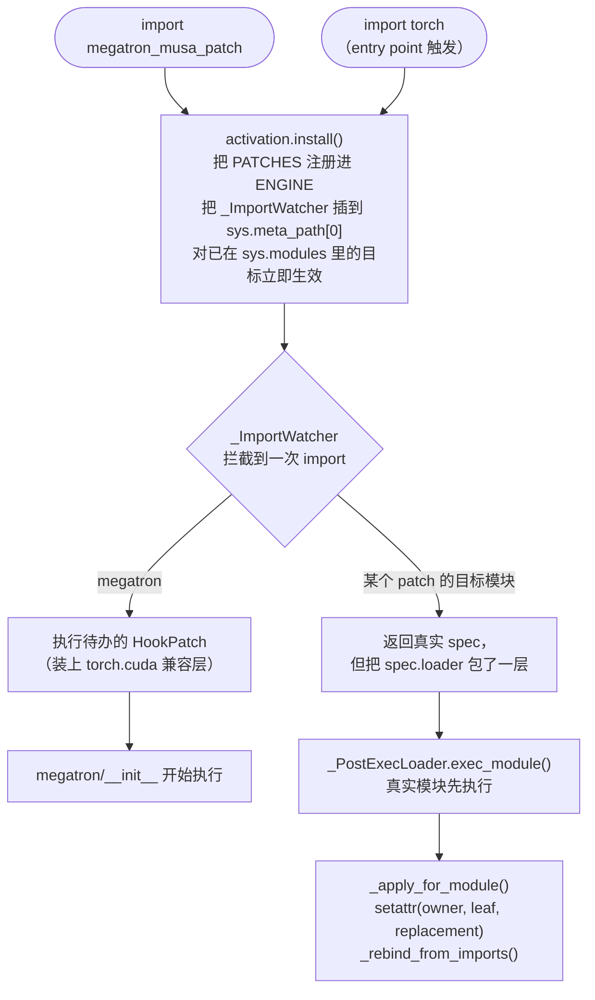

# 为 megatron-musa-patch 做贡献

本文介绍这个代码库的实现框架，以及如何往里加东西。提交改动前请先读：
[第 1 节](#1-基本约束)列出每个 patch 必须满足的约束，[第 6 节](#6-如何新增一个-patch)
是新增 patch 的完整流程，[第 11 节](#11-贡献者检查清单)是推送前的检查清单。

**使用**这个包请看 [`README_zh.md`](README_zh.md)。
Coding agent 还必须阅读 [`AGENTS.md`](AGENTS.md)，按其中的操作流程、测试命令和完成条件执行。
项目目标是原始上游单元测试和训练脚本在 MUSA 上直接运行，以及 ms-swift 等框架无需修改
Megatron-Core 调用；适配版示例运行成功只是其中一部分。

<https://github.com/kiscad/megatron-musa-patch> —— 分支 `v0.16.1-dev`，对应
Megatron-LM `core_v0.16.1`。

---

## 1. 基本约束

所有设计决策都受以下六条约束。违反其中任何一条的改动，"能跑"也不接受：

1. **绝不拷贝上游源码。** patch 只包裹或替换单个符号。一旦把某个 Megatron 文件搬进来，
   两份拷贝就开始分叉。
2. **不要求调用方安排 patch import 顺序。** 默认自动通道必须在 Megatron 使用 CUDA API
   之前激活。诊断时支持在引擎能力范围内的早/晚显式激活：已经创建的实例、闭包和类基类
   无法事后修复。始终不导入 Megatron 的进程，其补丁应保持 pending、不生效。
3. **激活保持惰性和明确作用域。** 尚未导入 Megatron 时，import 本包只注册补丁和 watcher，
   不得导入 torch/Megatron 或激活设备 shim。已经加载的目标可以立即应用补丁；显式
   `apply()` 则有意主动导入目标。
4. **每个 patch 都必须可删除、可复审。** 每条记录都带 `rationale`（观测到的根因）、
   `strategy`（替换实现做了什么）、`upstream` 和 `remove_when`（绑定到具体测试的
   删除条件）。`remove_when` 条件一旦成立就该删掉，而不是"留着以防万一"。
5. **上游和调用方无需修改。** 不得通过修改 Megatron 源码、测试、fixture、断言、训练脚本，
   或要求 ms-swift 添加 MUSA/CUDA 分支、额外 patch import 来修复兼容性。适配集中在本包，
   使用自动激活执行原始入口验收。
6. **保持公开契约，如实报告缺口。** 保持签名、配置语义、输出结构、梯度、分布式行为和
   checkpoint 兼容性。回退必须在有依据的容差内保证数值正确，说明性能和功能限制。
   core 修复不能依赖 `megatron.training`；跳过项、强制关闭功能或 smoke 成功不能代表全面兼容。

---

## 2. 仓库结构

```
src/megatron_musa_patch/
├── __init__.py            公开 API；import 时安装 watcher
├── activation.py          三个激活通道；负责注册 PATCHES
├── _engine.py             patch 引擎：注册表、import hook、apply/unapply/report
├── _compat.py             上游版本检测、目标解析、守卫
├── _env.py                所有环境变量开关，集中一处
├── _errors.py             异常类型
├── backends/
│   └── torch_cuda.py      torchada + 4 个 Megatron 专用 torch 覆盖
└── patches/
    ├── __init__.py        ledger：聚合下面各模块的 PATCHES
    ├── _python_compat.py  为新版 Megatron 补齐标准库名字的 hook
    ├── _torch_backend.py  安装 torch.cuda 兼容层的 hook
    ├── _device_arch.py    NVIDIA 尺度的设备 capability / 架构版本
    ├── _distributed.py    MCCL 进程组干净退出
    ├── _transformer_engine.py  忽略 MUSA 上游 Transformer Engine 版本阈值；按真实签名分发 TE 调用
    ├── _layer_norm.py     纯 PyTorch FusedLayerNorm、block LayerNormImpl
    ├── _rope.py           Transformer Engine 未提供时使用 apex 的融合 RoPE
    ├── _training.py       fused_kernels.load / set_jit_fusion_options 空操作、DP-overlap 策略、profiler 选择
    ├── _checkpointing.py  去 fork 的分布式 checkpoint writer
    └── _control_collectives.py  模块局部 torch 代理：启动时间戳、checkpoint 主机屏障、信号 safe-globals

tests/
├── conftest.py                  干净的 Engine fixture 与假模块 fixture（单测全程不碰硬件）
├── test_engine.py               引擎核心（不需要 GPU / Megatron）
├── test_engine_lifecycle.py     同目标链式 patch、所有权、失败原子性
├── test_activation.py           激活通道与 entry point 延迟安装（子进程）
├── test_ledger.py               ledger 契约与作用域守卫
├── test_python_compat.py        解释器 backport：所有权与撤销
├── test_device_arch.py          合成 capability hook
├── test_layer_norm.py           norm 回退类的契约
├── test_te_layer_norm.py        TE norm-linear 回退契约（CPU + 可选 MUSA）
├── test_transformer_engine.py    MUSA Transformer Engine 版本检查策略
├── test_rope.py                 融合 RoPE 选择：apex kernel 安装与降级策略（CPU + 可选 MUSA）
├── rope_smoke.py                硬件 worker：apex kernel 与 Megatron 非融合参考实现比对
├── test_training_profile.py     validate_args 包装器（overlap / profile）
├── test_checkpointing.py        串行 writer 与上游协议一致（stub 上游）
├── test_control_collectives.py  控制面通信代理契约（stub 上游 + 可选真实上游）
├── test_torch_cuda.py           后端层：CPU 安全 stub + 真实 MUSA 契约
└── test_megatron_integration.py 对真实 Megatron 的端到端（子进程、需显式开启）

examples/                       run_pretrain_smoke.sh（2 卡自检）、train_llama3_8b_musa.sh（MUSA llama3-8b）、train_llama3_8b_h100_fp8.sh（上游启动器）
```

大致划分：`_engine.py` 是机制，`patches/` 是内容，两者基本不需要了解对方的细节。

---

## 3. patch 引擎

### 3.1 patch 是数据

```python
AttrPatch(
    id="megatron.transformer-block.layer-norm.impl-local",
    target="megatron.core.transformer.transformer_block:LayerNormImpl",
    replace=_block_layer_norm_impl,        # Callable[[当前值], 替换值]
    rationale="The affected TE MUSA norm op aborted in allocateSpace; ...",
    strategy="Bind the block's default norm to the patched local class; ...",
    upstream="NVIDIA/Megatron-LM megatron/core/transformer/transformer_block.py",
    remove_when="BLOCK_LAYERNORM=upstream passes LayerNorm/RMSNorm parity tests",
)
```

`_engine.py` 里只有两个 dataclass：

| 类型 | 含义 |
|---|---|
| `AttrPatch` | 把 `<module>:<attribute>` 换成 `replace(当前值)`。`target` 支持嵌套属性（`module:Class.method`）。同目标的 patch 组成链：工厂按注册顺序在同一个绑定上组合，重复应用不会叠加 wrapper，`unapply()` 一步还原原始对象。 |
| `HookPatch` | 在 `trigger`（模块名）即将被 import 之前执行一次回调；返回 `False` 表示放弃。拥有运行时状态的 hook 必须提供 `undo`，`unapply()` 会按逆序调用它们。 |

因为 `replace` 拿到的是**当前对象**，patch 可以用 `functools.wraps` 包住原实现，而不是整个
替换。返回 `None` 表示"不改"，会被记为 `skipped`——这正是 patch 有条件退出的方式
（见 `MEGATRON_MUSA_PATCH_BLOCK_LAYERNORM`）。

### 3.2 生命周期

确实需要协作时，用 `AttrPatch.requires=("companion.id",)` 声明同一模块不同属性之间的
前置关系。引擎自动排序，拒绝循环依赖和跨模块依赖；前置补丁缺失、禁用或退出时，消费者
记录带原因的 `skipped`，绝不扩展 `ONLY` 或覆盖 `DISABLE`。能够独立的工厂不引入依赖；
参照 `tests/test_patch_independence.py`、`tests/test_engine_dependencies.py` 验证单独选择、
逆序注册和卸载。



在 watcher 监听的导入路径上，patch 在目标模块执行完成、import 返回调用方之前生效。
默认自动激活应消除调用方额外 import 的需要。晚激活仍受前述实例、闭包和类基类的限制，
必须用实际调用方的导入路径验证。

### 3.3 容易踩的细节

* **`find_spec` 重入。** `importlib.util.find_spec("a.b")` 会 import 父包，并从
  `sys.meta_path` 头部开始遍历——也就是会再次调用我们自己，直接递归爆栈。
  `Engine._find_real_spec` 改为直接遍历**其它** finder。
* **`LazyLoader`。** lazy loader 会把 `exec_module` 推迟到我们的 hook 之后，并把
  `spec.loader` 换成内层 loader，reload 时绕过我们。watcher 会把它拆开，对被 patch 的模块
  强制即时加载。
* **`from x import y`。** `import` 是按值绑定，已经执行过 `from x import y` 的模块会一直
  持有旧对象。引擎只对 `megatron.` 前缀模块中的**函数、类、builtin** 的同名别名重绑——
  标志位和基本类型绝不全局扫改；自己声明为 patch 目标的模块则留给各自的声明周期处理。
* **reload。** `importlib.reload` 会重新执行模块体，把原对象恢复回来。所以
  `_apply_target` 每次都用同一性重新判断，并从记录的基线重建整条链，而不是叠加 wrapper。
* **所有权。** 绑定会记录属性最初是否由模块自己拥有：`unapply()` 时自有属性恢复原值、
  继承来的属性被删除；patch 之后被第三方改写的属性不会被覆盖，引擎外修改过的目标会抛
  `PatchConflict` 而不是被悄悄覆盖。
* **原子链。** 一个目标的整条链（属性 + 别名）只有在所有工厂都成功时才提交；任一失败
  回滚到基线并记为 `failed`。hook 失败必须自行清理已做的部分变更；hook 的 `undo` 失败
  会阻止重新 install，直到 `unapply()` 成功。
* **模块不存在。** 目标模块根本没安装时（例如只装了 `megatron-core` wheel 时的
  `megatron.training`），watcher 记一次 `skipped` 后就不再监听，避免每次 import 都白跑一遍
  查找。

### 3.4 失败行为

`require_attr` 抛 `PatchTargetMissing`，信息里带 patch id、点分符号和检测到的 Megatron
版本。`replace` 回调抛异常会被包成 `MegatronMusaPatchError`，同样带上这些上下文。这是刻意
的：静默失效的 patch 比 import 期的响亮报错难查得多。

---

## 4. 激活

`activation.py` 管住仅有的三个入口，它们最终都走到同一个幂等的 `ENGINE.install()`：

| 通道 | 入口 | 说明 |
|---|---|---|
| 自动 | `[project.entry-points."torch.backends"]` → `megatron_musa_patch:_torch_backend_autoload` | PyTorch 在 `import torch` 最末尾调用。这是官方的 out-of-tree 设备后端钩子（torch_musa、torch_npu 也注册在这里）。 |
| 显式 | `import megatron_musa_patch` | 只注册并监听；Megatron 出现前不生效。 |
| 命令式 | `megatron_musa_patch.apply()` | 注册、监听，**并且**主动 import 目标模块立即全部生效。测试用。 |

`_torch_backend_autoload` **绝不能抛异常**：它在 `import torch` 内部运行，抛出去会让环境里
每个进程一起挂掉。实现里 catch 了所有异常并记日志。

新进程安装 watcher 时不激活 torch 兼容层，其 `HookPatch` 等待 `megatron` 导入。
目标已加载时安装可以立即应用补丁，显式 `apply()` 也会主动导入目标。
只测试显式 import 不能证明自动激活有效。

---

## 5. `torch.cuda` 兼容层

`backends/torch_cuda.py` 刻意保持很薄，因为它做了分工：

* **torchada**（硬依赖）负责机械翻译：`torch.cuda.*` → `torch.musa.*`、`torch.device`
  patch、tensor 工厂改写、`nccl` → `mccl`。这部分是 **torch_musa 变动**时会坏的一半，
  而它是摩尔线程自己的包。注意 import torchada 会把 `sys.modules["torch.cuda"]` 换成
  带缓存的 proxy 模块并改写工厂/分布式状态，且没有 undo API——这些外部效果在本包里
  不可逆。
* **本模块**负责 Megatron 需要、torchada 没做的 4 件事。这部分是 **Megatron 变动**时会坏
  的一半。

| 覆盖 | 存在的原因 |
|---|---|
| 实时 `is_available()` | torchada 刻意让它保持 `False`，而 Megatron 对它 assert。绑定到 `torch.musa.is_available`，不是常量。 |
| `Tensor.type()` 名字 | 返回 `torch.musa.*`，而 Megatron 的 optimizer 拿它和 `torch.cuda.*` 比较。转换和 CPU 名字原样透传。 |
| `CUDAGraph` 别名 | torchada 的 `torch.cuda.graphs` 没有 `CUDAGraph`；把 `MUSAGraph` 以 CUDA 拼写暴露出去。 |
| tensor 子类的 `Tensor.musa()` | torch_musa 的 C dispatch shim 对 tensor 子类（TE `Float8Tensor`）会丢 `non_blocking`/`memory_format` 且错误处理 CPU 目标；子类改走 `.to()`。 |

本包自己的覆盖会被记录，`unapply()` 时还原到 *torchada 之后* 的基线；之后被第三方改写的
属性不会被覆盖，激活失败会回滚这些覆盖。要移除 torchada 自身的效果只能换新进程。我们
仍然绝不直接 `sys.modules["torch.cuda"] = torch.musa`：两个命名空间确实不一样
（`torch.cuda.memory` vs `torch.musa.core.memory`，等等）。

torchada 已经提供的行为**不再重复实现**，而是在 `tests/test_torch_cuda.py` 里断言。这样
torchada 一旦回归会直接测试失败，而不是静默依赖我们自己写的一份覆盖。该测试文件因此分成
"本包拥有的覆盖"和"与 torchada 的契约"两部分。

有一个坑值得记住：`import torchada` 会**附带应用它的 patch**。所以永远不要用
`import torchada` 去探测它是否存在——用 `importlib.util.find_spec`。本包早期的一个版本就是
为了列出可用模式而 import 了它，结果在调用方没要求的情况下装上了一层全局 shim。

---

## 6. 如何新增一个 patch

1. **找最小的接缝。** 优先级从高到低：
   * 能保持调用方原始配置的 Megatron 实现或已有扩展点（要求调用方改开关只是调试
     workaround，不能作为兼容性修复完成的依据）；
   * 包裹单个函数；
   * 替换一个类；
   * 对单个函数做最小改写——最后手段，在 `rationale`/`strategy` 中记录来源、语义差异
     和升级核对点。
2. **写记录**，放进 `patches/` 下对应的 `_*.py`（或新建一个模块并在
   `patches/__init__.py` 的 `MODULES` 里注册）。
3. **填全 `rationale` / `strategy` / `upstream` / `remove_when`。** `tests/test_ledger.py`
   会强制检查这四项——这不是可选文档。拥有运行时状态的 hook 还需要提供 `undo`。
4. **保持 `patches/` 在没有 torch 时也能 import。** `import torch` 放在 `replace` 回调
   内部，绝不放在模块顶层。参考 `patches/_checkpointing.py`。
5. **能用 `_env` 开关就别写死。** 在调用时读取（helper 都是惰性的），这样测试和包装脚本
   可以在 import Megatron 之前临时设置。
6. **补有意义的回归测试。** 引擎行为用假模块；patch 契约放对应的 `test_*.py`。
   激活真实补丁集的集成测试在独立子进程运行，再直接重跑原始失败的上游测试或调用入口。
   只有 stub 通过不能证明 API 或数值兼容。

### 完整示例

假设 `megatron.core.transformer.moe.router` 新增了一个假设 NVIDIA 行为的 `TopKRouter`：

```python
# src/megatron_musa_patch/patches/_router.py
from __future__ import annotations

from typing import Any

from .._engine import AttrPatch

__all__ = ["PATCHES"]


def _router_impl(original: Any) -> Any:
    """包裹而不是替换：保留上游行为，只改一个分支。"""
    import functools

    @functools.wraps(original)
    def forward(self, *args, **kwargs):
        # ... MUSA 相关的调整 ...
        return original(self, *args, **kwargs)

    return forward


PATCHES = (
    AttrPatch(
        id="megatron.moe.router.topk-forward",
        target="megatron.core.transformer.moe.router:TopKRouter.forward",
        replace=_router_impl,
        rationale="...观测到的故障和原因...",
        strategy="...wrapper 改了什么、保留了什么...",
        upstream="NVIDIA/Megatron-LM megatron/core/transformer/moe/router.py",
        remove_when="...绑定到测试的删除条件...",
    ),
)
```

然后在 `patches/__init__.py` 的 `MODULES` 里加上它，跑：

```bash
MEGATRON_MUSA_PATCH_DEBUG=1 python -c "import megatron_musa_patch as m; m.apply()"
```

确认新的 id 状态是 `applied`。

### 在包外扩展

下游项目不需要 fork 就能注册自己的 patch：

```python
from megatron_musa_patch import AttrPatch, ENGINE

ENGINE.register([AttrPatch(id="my-project.x", target="...", replace=lambda old: ...)])
ENGINE.apply_now()
```

它们会获得和内置 patch 完全相同的顺序保证、漂移检测，并出现在 `report()` 里。
这是可选扩展 API；通用 MUSA 兼容性必须由本包提供，不得依赖下游自行注册。

---

## 7. 测试

```bash
python -m pip install -e ".[dev]"
python -m pytest -q    # 可在 CPU 环境运行；硬件相关用例可能跳过
MEGATRON_MUSA_RUN_INTEGRATION=1 MEGATRON_LM_PATH=/path/to/Megatron-LM \
    python -m pytest tests/test_megatron_integration.py -q    # 真实栈检查（子进程）
```

| 文件 | 覆盖内容 | 依赖 |
|---|---|---|
| `test_engine.py` | import hook、别名修复、reload、unapply、开关过滤、错误路径 | 无（合成模块） |
| `test_engine_lifecycle.py` | 同目标链式 patch、所有权、失败原子性、hook undo | 无 |
| `test_activation.py` | 激活通道、entry point 延迟安装、禁用时的 apply | 无（子进程） |
| `test_ledger.py` | ledger 契约：id 唯一、`rationale`/`strategy`/`upstream`/`remove_when` 非空、hook undo、探测不打扰 watcher | 无 |
| `test_device_arch.py` / `test_layer_norm.py` / `test_training_profile.py` / `test_checkpointing.py` | 各 patch 针对 stub 上游 API 的契约 | 部分 需要 megatron-core |
| `test_te_layer_norm.py` | TE norm-linear 回退：类分发、RMSNorm 透传、sharded state dict | CPU 契约 + megatron-core；MUSA 轮次需显式开启 |
| `test_rope.py` | 融合 RoPE 选择：仅在上游缺失时安装 apex kernel、不覆盖 TE kernel、`ROPE_FUSION=0`、interleaved/context parallel 降级时不修改共享配置 | 无；数值比对轮次在 MUSA 上跑 `rope_smoke.py`，需显式开启 |
| `test_control_collectives.py` | 模块局部 torch 代理：启动时间戳、checkpoint 主机屏障、信号 safe-globals、上游退出策略 | torch；真实上游轮次需 `MEGATRON_LM_PATH`，双卡 MUSA 轮次需显式开启 |
| `test_torch_cuda.py` | 兼容层与 torchada 契约 | stub 任何环境可跑；真实契约需要 MUSA |
| `test_megatron_integration.py` | 真实 Megatron：每个 patch 都解析为 applied/skipped、替换后的 `FusedLayerNorm` 与 `torch.nn.functional.layer_norm` 数值一致、`get_device_arch_version() == 8`、`fused_kernels.load` 为空操作 | Megatron + MUSA，需显式开启 |

写测试时的注意点：

* `conftest.py` 提供干净的 `Engine()` fixture，引擎测试不会碰到进程级注册表；另有
  `fake_package`（写一个临时可 import 模块）和 `stub_module`（往 `sys.modules` 注入合成
  模块）。
* `test_megatron_integration.py` **必须**跑在子进程里。patch 集是进程级的，在本进程里跑会
  让结果依赖执行顺序。
* 发现 delegate 有缺口时，优先加**测试**而不是加覆盖。`test_torchada_*` 系列就是我们依赖
  但不由我们实现的那部分契约。

硬件上的端到端自检：

```bash
MEGATRON_LM_PATH=/path/to/Megatron-LM NPUS=2 \
    PYTHON=/path/to/venv/bin/python bash examples/run_pretrain_smoke.sh
```

健康的运行会跑完 5 步、loss 为有限值、保存 `torch_dist` checkpoint，且无 MCCL 错误或
退出挂起。短程 mock 训练不要求 loss 单调下降。脚本会重建 `OUTPUT_DIR`，并关闭 optimizer/RNG
保存；请使用专用临时目录，涉及 checkpoint 语义的改动另测完整保存和恢复。

### 本仓库测试之外的验收

按改动影响分别在独立进程运行：本包回归、通过分布式 pytest 入口运行的原始 Megatron-LM
单元测试、原始训练脚本、实际 ms-swift Megatron-Core 工作流。还要验证只有 wheel 的环境，
确保 Megatron-LM checkout 不在 `PYTHONPATH` 或当前工作目录中。具体命令和记录要求见
[agent 操作手册](AGENTS.md)。

不得修改上游 `conftest.py`、添加掩盖 MUSA 故障的 skip/xfail、放宽断言，或用本地改写测试
替代原始测试。记录收集/通过/失败/跳过数量和原因：退出码为 0 但没有执行测试不算成功。
按原始测试准备卡数和数据；无法运行的项目保留为明确验证缺口。自动激活验收不能在调用方
提前 import 本包，显式 `apply()` 的诊断属于另一条通道。

---

## 8. 设计取舍与被否决的方案

| 被否决 | 原因 |
|---|---|
| 拷贝整个上游文件（老 `musa_patch/` 的做法） | 67 个文件 / 1.28 万行 / 32 个拷贝类会静默分叉，需要 `for k in sys.modules: setattr(...)` 扫全表，而且没有任何"改了什么"的清单。 |
| `unittest.mock` / `pytest.monkeypatch` | 会破坏 `__name__`、`__signature__`、`__wrapped__`；mock 对象会漏进 `isinstance` 判断；生产环境不可逆。 |
| AST / `SourceLoader` 改写 | 很强大，也是唯一能在定义处改基类的办法——但改写后的代码会被缓存进普通的 `__pycache__`，除非自己实现 pytest 那套带 tag 的 pyc 路径，否则会污染机器上之后所有进程。本包的 patch 全是属性赋值，不值得。 |
| 用 `.pth` 自动激活 | 会让环境里每个解释器都付出代价；失败模式是每个进程一次 traceback（或者整行被静默忽略）；`python -S` 还会绕过它。`torch.backends` entry point 触发得足够早，而且可以关。 |
| `sitecustomize.py` | 抢占管理员命名空间、会和其它包冲突、自身错误被吞掉。 |
| `wrapt` | 很好的库，但本包只有约 10 个 wrapper，它那套记账（`unapply` 用的 handle、幂等用的同一性判断）就是我们已有的十几行代码。激活路径上少一个依赖。如果将来 wrapper 链变深再考虑。 |
| 把 Megatron 声明成安装依赖 | PyPI 上的 `megatron-core` 只含 `megatron/core/`，但有 4 个 patch 的目标在 `megatron.training` / `megatron.legacy`，wheel 里根本没有；PyPI 上也没有 `megatron-lm`。真实用法需要锁定到某个 tag 的源码 checkout，pip 表达不了；而且 `megatron` 是 namespace 包，pip 装的那份会和 checkout **合并**而不是替换，谁生效取决于 `sys.path` 顺序。版本契约改为运行时对实际可 import 的 Megatron 检查（`_compat.check_version`、`check_megatron_present`）。 |
| 自己写 `torch.cuda` 别名层 | 写过，432 行，覆盖度还不如 torchada。维护一份厂商包的次等拷贝不值得。 |
| 直接 `sys.modules["torch.cuda"] = torch.musa` | 两个命名空间不一样（`torch.cuda.memory` vs `torch.musa.core.memory`、`nccl` vs `mccl`……）。子模块 import 和任何持有原模块引用的代码都会坏。 |
| 重复实现 torchada 已有的东西 | 复制出来的代码会和被复制的东西以不同速度腐烂。改成在测试里断言。 |

---

## 9. 调试

```bash
# 哪些生效了、哪些被跳过、为什么
python -c "import megatron_musa_patch as m, json; print(json.dumps(m.report(), indent=2))"

# 观察 patch 落地过程，含触发来源
MEGATRON_MUSA_PATCH_DEBUG=1 python -c "import megatron_musa_patch as m; m.apply()"

# 隔离单个 patch
MEGATRON_MUSA_PATCH_DISABLE=megatron.dist-ckpt.no-fork-writer python train.py

# 或整体关掉
MEGATRON_MUSA_PATCH=0 python train.py
```

看 `report()` 时的几个不变量：

* 目标导入前 `pending` 是惰性激活的正常状态；成功调用 `apply()` 后仍为 `pending`
  则需排查导入错误、未解析模块和该记录的 `detail`。
* `skipped`：要么被环境变量关了（`detail` 里会写），要么模块没装，要么 `replace` 主动
  放弃。
* `report()` 为空：包根本没装上——检查 `MEGATRON_MUSA_PATCH=0` 和 entry point 注册。

---

## 10. 分支与发布

`v0.16.1-dev` 是针对 Megatron-LM `core_v0.16.1` 的开发分支。上游发新版本时**新开分支**
（`vX.Y.Z-dev`），而不是在这条分支上做破坏性改动。

包版本跟随上游，所以版本字面量只在 `pyproject.toml` 出现一次（`__version__` 从安装后的
元数据读回）：

| 版本 | 何时 |
|---|---|
| `0.16.1.dev0` | 在 `v0.16.1-dev` 上 |
| `0.16.1` | 从该分支切出的发布版 |
| `0.16.1.post1` | 该发布版之上的修复 |
| `0.16.2.dev0` | 新分支 `v0.16.2-dev` |

跟进新的上游版本时，还要同步更新 `_compat.py` 里的 `SUPPORTED_VERSION_SPEC` 和
`_in_supported_range()`、两份 README 的参考环境与实际验证结果，并且预期
`test_ledger.py` / 集成测试会指出哪里变了。

---

## 11. 贡献者检查清单

提交前请确认：

代码/运行时检查按改动影响执行；纯文档改动检查链接、命令语法和源码一致性，无需启动训练。

- [ ] 没有把任何上游文件拷进本仓库。
- [ ] 上游测试、断言、训练脚本和框架调用方无需修改；已通过自动激活重跑原始失败入口。
- [ ] core 兼容不依赖 `megatron.training` 或框架侧 MUSA 分支；记录了 wheel-only 验证及
      无法运行的检查。
- [ ] patch 与 import 顺序无关，且在 Megatron 使用 CUDA API 之前已生效
      （分别在 `import megatron` 之前和之后 import 本包各测一次）。
- [ ] `rationale` / `strategy` / `upstream` / `remove_when` 都填了，而且写得具体。
- [ ] `patches/` 在没有 `torch` 的路径下仍能 import。
- [ ] 如果用户可能想恢复上游行为，新行为挂在 `_env` 开关后面。
- [ ] 代码改动通过 `python -m pytest -q`，包括适用的
      `MEGATRON_LM_PATH=... python -m pytest tests -q` 覆盖。
- [ ] 有硬件的话：`examples/run_pretrain_smoke.sh` 退出码 0 且无 MCCL 报错。
- [ ] 用户可见的行为、参数或开关有变化时，`README.md` 和 `README_zh.md` 都已更新。
- [ ] 已记录适用的验收命令、revision、通过/失败/跳过数量、回退代价和未解决缺口；流程
      变化同步更新两份贡献指南和 `AGENTS.md`。
